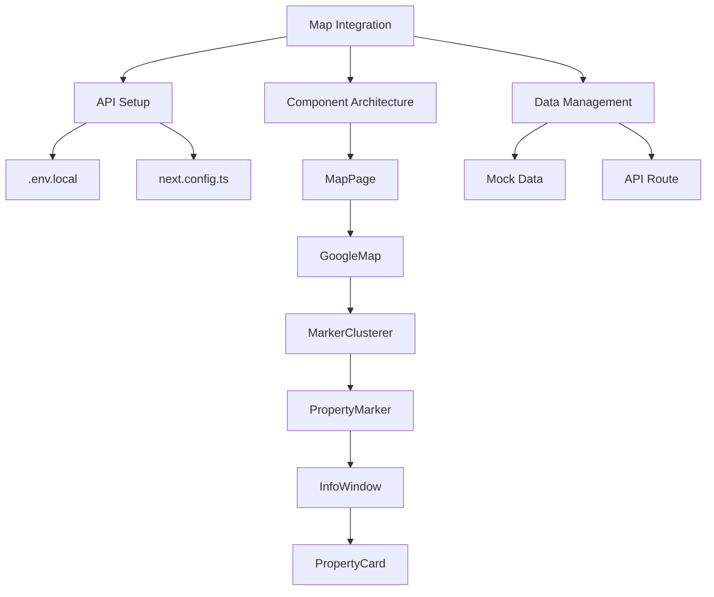

# Google Maps Integration Implementation Plan

## Architecture Overview


## 1. Environment Setup
```bash
npm install @react-google-maps/api @types/google.maps
```

## 2. Configuration

### .env.local
```env
NEXT_PUBLIC_GOOGLE_MAPS_API_KEY=your_api_key_here
```

### next.config.ts Modification
```javascript
const nextConfig = {
  env: {
    NEXT_PUBLIC_GOOGLE_MAPS_API_KEY: process.env.NEXT_PUBLIC_GOOGLE_MAPS_API_KEY,
  },
  // ... existing configuration
}
```

## 3. Component Structure

### Map Page (src/pages/map.tsx)
```typescript
import { GoogleMap, Marker, useLoadScript } from '@react-google-maps/api'
import { Card } from '@/components/ui/card'
import { Property } from '@/lib/types'

const MapPage = () => {
  const { isLoaded } = useLoadScript({
    googleMapsApiKey: process.env.NEXT_PUBLIC_GOOGLE_MAPS_API_KEY!
  })

  // Temporary mock data - replace with API call
  const properties: Property[] = [
    {
      id: '1',
      lat: 13.7563,
      lng: 100.5018,
      price: 5000000,
      imageUrl: '/property1.jpg',
      title: 'Luxury Riverside Condo',
      bedrooms: 2,
      bathrooms: 2
    }
  ]
  
  return (
    <div className="h-screen w-full">
      {isLoaded ? (
        <GoogleMap
          zoom={12}
          center={{ lat: 13.7563, lng: 100.5018 }}
          mapContainerClassName="w-full h-full"
        >
          {properties.map(prop => (
            <Marker
              key={prop.id}
              position={{ lat: prop.lat, lng: prop.lng }}
              onClick={() => {/* Implement InfoWindow toggle */}}
            />
          ))}
        </GoogleMap>
      ) : <div>Loading map...</div>}
    </div>
  )
}

export default MapPage
```

## 4. Type Definitions (src/lib/types.ts)
```typescript
export interface Property {
  id: string
  lat: number
  lng: number
  price: number
  imageUrl: string
  title: string
  description?: string
  bedrooms?: number
  bathrooms?: number
}
```

## Next Steps
1. Implement API endpoint for property data retrieval
2. Add InfoWindow component with PropertyCard integration
3. Create loading skeletons for map initialization
4. Add map controls (zoom, type selection)
5. Implement search/filter functionality
6. Add error boundary handling
7. Configure CSP headers for Google Maps API